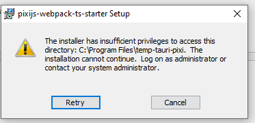

This is starter for PixiJS.

It use:
- Typescript
- Webpack for bundling
- A development server
- NPM
- file-loader so that you can import image in code

You may want to update packages right after downloading:

```sh
npm i pixi.js@latest file-loader@latest webpack-cli@latest webpack-dev-server@latest ts-loader@latest webpack@latest typescript@latest 
```


## Tauri

If you don't need to export as a desktop app, you can remove Tauri dependencies and `src-tauri`, 
otherwise you should read https://tauri.studio/docs/getting-started/prerequisites .
And also:

> Especially during the alpha and beta phases, we expect you to keep all Tauri dependencies and toolchains up to date. 
> There is no support for any versions other than latest.

> The Tauri JS CLI has a command to install and update all needed dependencies, just run tauri deps install or tauri deps update.

https://tauri.studio/docs/development/updating-dependencies


### Hermit Pattern

https://tauri.studio/docs/architecture/recipes/hermit

> The Hermit recipe is a pattern for ultimate application isolation where all logic is self-contained in the 
> Window and the binary exists merely to bootstrap the Window. There is no communication back to Rust from the Window, 
> there is no localhost server, and the Window has no access to any remote resources. 
> The Hermit is great for interactive Kiosk Mode and standalone HTML based games.

```json5
{
  "tauri": {
    "allowlist": {
      "all": false,       // disable and tree-shake all api functions
    }
  }
}
```


## Tauri dev

```shell
npm run start # Start dev server first
npm run tauri dev
```


## Tauri build

```shell
npm run build # Build game first
npm run tauri build
```

On Windows, an msi installer will be created here: 
`pixijs-webpack-ts-starter\src-tauri\target\release\bundle\msi\pixijs-webpack-ts-starter_0.1.0_x64_en-US.msi`.


## Tauri non-admin install

Original tauri `.wxs` file has been modified, because by default Tauri installer (Tauri is using wix) prompt for elevation.

Both property have been added:
```
        <Property Id="ALLUSERS" Value="2"/>
        <Property Id="MSIINSTALLPERUSER" Value="1"/>
```

If you want the default installation, remove:

```
        "wix": {
          "template": "./custom-no-admin-install.wxs"
        }
```
in tauri config (you can remove the `.wxs` file too if you want).

Make sure the template is up to date with the [latest](https://github.com/tauri-apps/tauri/blob/dev/tooling/bundler/src/bundle/windows/templates/main.wxs).

Important links:
- https://tauri.studio/docs/distribution/windows/#customizing-the-windows-installer
- https://tauri.studio/docs/api/config/#tauri.bundle.windows.wix.template

Warning: I had no issue with install and uninstall, but I cannot assure you there isn't some drawback.

Warning: Installing in a write protected directory will result in an error without admin rights.




## Animated sprites

I have made a helper function based on https://github.com/pixijs/pixijs/pull/3676 .
If you want to use pixiJS loader instead, you will need to use CopyWebpackPlugin to add
assets file in the build.
